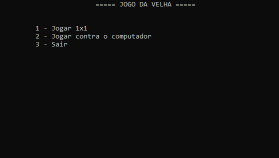
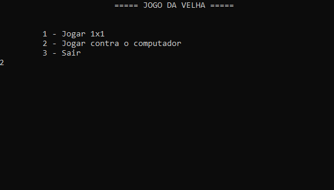

# Jogo da Velha - Console App

## Sobre
Simples jogo da velha com interface de terminal.

 <a href="#sobre">Sobre</a> • 
 <a href="#demonstração">Demonstração</a> • 
 <a href="#como-usar">Como usar</a> • 
 <a href="#tecnologias">Tecnologias</a> • 
 <a href="#licença">Licença</a> • 
 <a href="#autor">Autor</a>

## Demonstração

 
  Humano contra humano.

  

 
  

 
  Humano contra computador.
  

    As jogadas não são bem calculadas pelo computador, mas ainda é divertido.    
  

  

 
  

## Como usar

Para jogar, basta baixar o respositório, entrar na pasta "Executável" e abrir o executável que está nela. 

Se quiser modificar, contribuir com o projeto, primeiro é necessário instalar o [.NET](https://dotnet.microsoft.com/download). Em seguida, instale o [Visual Studio](https://visualstudio.microsoft.com/downloads/) ou o [Visual Studio Code](https://code.visualstudio.com/).

## Tecnologias

[.NET](https://dotnet.microsoft.com/download)

## Licença

Projeto sob licença do MIT. Leia o [LICENSE](https://github.com/anderson314/jogo-da-velha-console-app-cs/blob/master/LICENSE), para mais informações.

## Autor

- [Anderson Rodrigo da Silva](https://github.com/anderson314)
  -  
